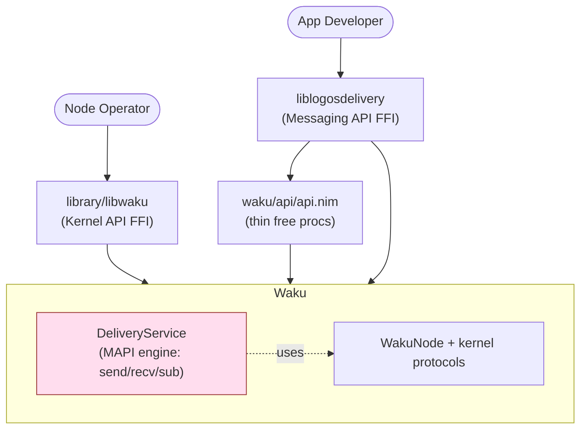
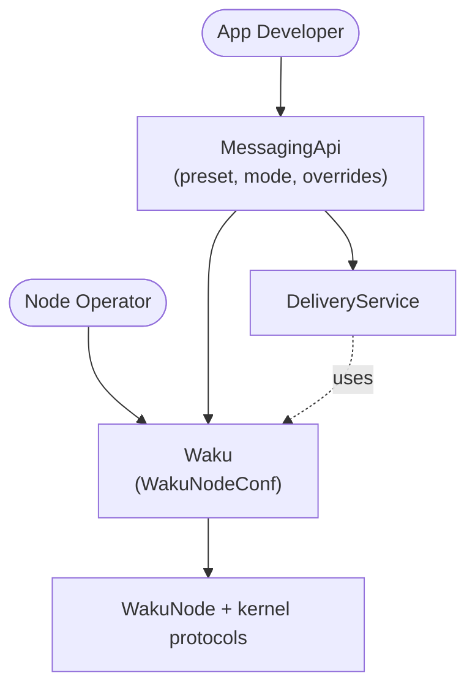
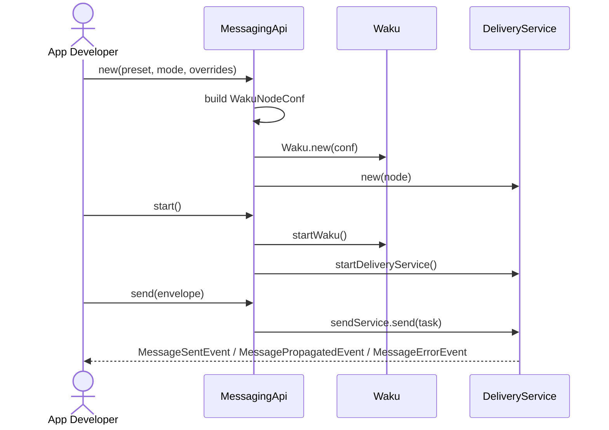
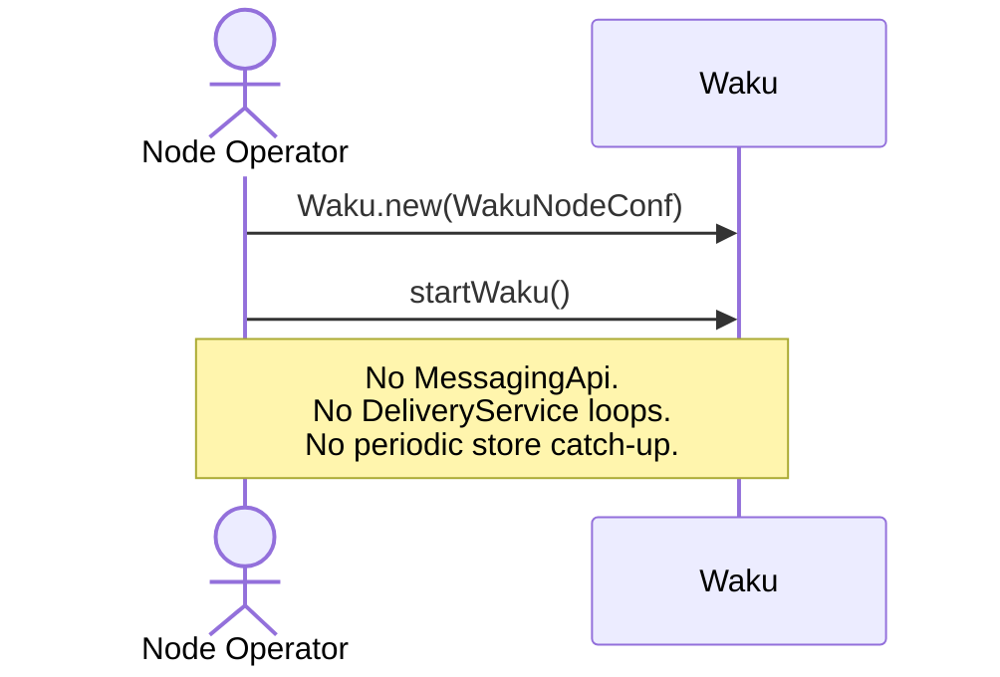

# Messaging API has no Nim identity, and its routines run inside the node

## Summary

The Messaging API is described in the [spec](https://github.com/logos-messaging/specs/blob/master/standards/application/messaging-api.md) as an *opinionated layer above the kernel protocols* (RELAY, LIGHTPUSH, FILTER, STORE, discovery). It owns reliability strategies, automatic re-subscriptions, store-based catch-up, peer management for filter subscriptions, and the MAPI event surface (`message:received`, `message:sent`, `message:send-propagated`, `message:send-error`, `health:connection-status`).

In code, those routines are not a layer above the node — they live **inside** `Waku`, are constructed in `Waku.new()`, started in `startWaku`, and stopped in `Waku.stop()`. The Messaging API surface itself (`waku/api/api.nim`) is just thin free procs over `Waku.deliveryService`, and `liblogosdelivery` is a thin C-FFI shim over those procs. There is no Nim-level Messaging-API object — it cannot be used as a layer from Nim, only as C bindings.

This is a layering inversion of what the spec describes.

## Evidence

### MAPI routines live inside `Waku`

`Waku` directly owns `deliveryService` and runs its lifecycle:

- `deliveryService*: DeliveryService` is a field of `Waku`:

  https://github.com/logos-messaging/logos-delivery/blob/27ae07adaaea7beeae02cea9f8647b18cd9fb482/waku/factory/waku.nim#L75

- `Waku.new()` constructs the delivery service unconditionally:

  https://github.com/logos-messaging/logos-delivery/blob/27ae07adaaea7beeae02cea9f8647b18cd9fb482/waku/factory/waku.nim#L213-L214

- `startWaku()` starts it unconditionally:

  https://github.com/logos-messaging/logos-delivery/blob/27ae07adaaea7beeae02cea9f8647b18cd9fb482/waku/factory/waku.nim#L418-L420

- `Waku.stop()` stops it:

  https://github.com/logos-messaging/logos-delivery/blob/27ae07adaaea7beeae02cea9f8647b18cd9fb482/waku/factory/waku.nim#L517-L519

`DeliveryService` is exactly what the spec calls the Messaging API's background work:

- [`send_service.nim`](https://github.com/logos-messaging/logos-delivery/blob/27ae07adaaea7beeae02cea9f8647b18cd9fb482/waku/node/delivery_service/send_service/send_service.nim) — store-node confirmations of published messages (`checkMsgsInStore`, `ServiceLoopInterval`, `ArchiveTime`, `MaxTimeInCache`), retries, and emission of `MessagePropagatedEvent` / `MessageSentEvent` / `MessageErrorEvent`.
- [`recv_service.nim`](https://github.com/logos-messaging/logos-delivery/blob/27ae07adaaea7beeae02cea9f8647b18cd9fb482/waku/node/delivery_service/recv_service/recv_service.nim) — store-based catch-up of missed messages (`StoreCheckPeriod`), de-dup, and emission of `MessageReceivedEvent`.
- [`subscription_manager.nim`](https://github.com/logos-messaging/logos-delivery/blob/27ae07adaaea7beeae02cea9f8647b18cd9fb482/waku/node/delivery_service/subscription_manager.nim) — edge filter peer dialing, reconcile loop, per-shard subscription state, MAPI auto-subscribe semantics.

### The Nim "API" is not an object

[`waku/api/api.nim`](https://github.com/logos-messaging/logos-delivery/blob/27ae07adaaea7beeae02cea9f8647b18cd9fb482/waku/api/api.nim) is the only Nim-level entry point and it has no state of its own — every call dereferences `Waku.deliveryService`:

- `subscribe` → `w.deliveryService.subscriptionManager.subscribe(...)`
- `unsubscribe` → `w.deliveryService.subscriptionManager.unsubscribe(...)`
- `send` → `w.deliveryService.subscriptionManager.subscribe(...)` + `asyncSpawn w.deliveryService.sendService.send(...)`

There is no `MessagingApi` type. A Nim consumer cannot construct or hold a Messaging API; the only way to use it is the free procs against `Waku`, and the only real consumer is `liblogosdelivery`. A grep across the repo confirms it:

```text
$ grep -rln "waku/api/api" .
./api.md
./liblogosdelivery/README.md
./liblogosdelivery/logos_delivery_api/node_api.nim
./liblogosdelivery/logos_delivery_api/messaging_api.nim
```

### Kernel-API consumers transitively run MAPI routines

`library/libwaku` (the kernel-API library) also goes through `Waku.new()` and `startWaku()`. Because the delivery service is created inside `Waku`, every kernel-API consumer silently runs the MAPI send/recv/subscription loops. There is no opt-out and no boundary in code between "kernel" and "messaging" — that boundary today exists only in headers and docs (see #3851).

The same is true for the operator binary:

- [`apps/wakunode2/wakunode2.nim:54-60`](https://github.com/logos-messaging/logos-delivery/blob/27ae07adaaea7beeae02cea9f8647b18cd9fb482/apps/wakunode2/wakunode2.nim#L54-L60) — a fleet operator running `wakunode2` calls `Waku.new()` + `startWaku()` and therefore runs the full DeliveryService and everything else listed below.

### Other MAPI leaks beyond `deliveryService`

`DeliveryService` is the most obvious leak, but it isn't the only one. Several MAPI concerns are wired into the kernel layer (`Waku`, `WakuNode`, `NodeHealthMonitor`, the broker, the kernel relay/filter handlers).

**1. `health:connection-status` is computed and emitted by the kernel `NodeHealthMonitor`.**

The MAPI spec defines a `health:connection-status` event with states Disconnected / PartiallyConnected / Connected. That logic — `HealthyThreshold`, `calculateConnectionState`, the emitter — lives in the kernel-side health monitor, which is owned by `Waku`:

- `healthMonitor*: NodeHealthMonitor` field of `Waku`:

  https://github.com/logos-messaging/logos-delivery/blob/27ae07adaaea7beeae02cea9f8647b18cd9fb482/waku/factory/waku.nim#L73

- `EventConnectionStatusChange.emit(...)` from the health loop:

  https://github.com/logos-messaging/logos-delivery/blob/27ae07adaaea7beeae02cea9f8647b18cd9fb482/waku/node/health_monitor/node_health_monitor.nim#L514

- The `RequestConnectionStatus` provider, set up unconditionally in `startWaku`, exposes the same MAPI status:

  https://github.com/logos-messaging/logos-delivery/blob/27ae07adaaea7beeae02cea9f8647b18cd9fb482/waku/factory/waku.nim#L428-L438

The protocol-health and node-health REST endpoints are kernel concerns, but the connection-status derivation + emission is MAPI semantics living inside the kernel module.

**2. `MessageSeenEvent.emit` is hardcoded in the kernel relay/filter handlers.**

`MessageSeenEvent` is a MAPI-internal event ([`message_events.nim`](https://github.com/logos-messaging/logos-delivery/blob/27ae07adaaea7beeae02cea9f8647b18cd9fb482/waku/events/message_events.nim) — "Internal event emitted when a message arrives from the network via any protocol") that only `RecvService` listens to. Yet the emit calls live inside the kernel-level relay subscribe handler and filter-client push handler:

- Kernel relay handler:

  https://github.com/logos-messaging/logos-delivery/blob/27ae07adaaea7beeae02cea9f8647b18cd9fb482/waku/node/kernel_api/relay.nim#L94-L95

- `WakuNode` filter-client push handler:

  https://github.com/logos-messaging/logos-delivery/blob/27ae07adaaea7beeae02cea9f8647b18cd9fb482/waku/node/waku_node.nim#L595-L596

Every received message in a kernel-only deployment still goes through the broker emit, even though no one is listening.

**3. The event/request bus (`brokerCtx`) is a field of `WakuNode`, not just of MAPI.**

The broker context exists primarily to carry MAPI events and requests, but it's plumbed into the kernel layer:

- `WakuNode.brokerCtx*: BrokerContext`:

  https://github.com/logos-messaging/logos-delivery/blob/27ae07adaaea7beeae02cea9f8647b18cd9fb482/waku/node/waku_node.nim#L130

- `Waku.brokerCtx*: BrokerContext`:

  https://github.com/logos-messaging/logos-delivery/blob/27ae07adaaea7beeae02cea9f8647b18cd9fb482/waku/factory/waku.nim#L80

A kernel-only node carries the bus and the listeners regardless of whether anything MAPI-shaped is attached.

**4. MAPI-only request types are queried by the kernel.**

`RequestEdgeShardHealth` and `RequestEdgeFilterPeerCount` are explicitly documented as MAPI-only ("set by DeliveryService when edge mode is active"):

- [`waku/requests/health_requests.nim:41-52`](https://github.com/logos-messaging/logos-delivery/blob/27ae07adaaea7beeae02cea9f8647b18cd9fb482/waku/requests/health_requests.nim#L41-L52)

But they are *requested* from `WakuNode.startProvidersAndListeners`, so the kernel layer asks MAPI for state:

- https://github.com/logos-messaging/logos-delivery/blob/27ae07adaaea7beeae02cea9f8647b18cd9fb482/waku/node/waku_node.nim#L514

The dependency direction is wrong: the kernel should not know about edge-filter MAPI state.

**5. MAPI types live under `waku/api/types.nim` but are imported from the kernel.**

`ConnectionStatus`, `RequestId`, `MessageEnvelope` are MAPI types, but they are imported by kernel modules — `waku/requests/health_requests.nim` and `waku/events/health_events.nim` both `import waku/api/types`, and those are then imported by `waku_node.nim` and `node_health_monitor.nim`. The kernel module graph depends on the MAPI module.

**6. `AppCallbacks.connectionStatusChangeHandler` is a MAPI-shaped callback wired by the kernel FFI.**

[`AppCallbacks`](https://github.com/logos-messaging/logos-delivery/blob/27ae07adaaea7beeae02cea9f8647b18cd9fb482/waku/factory/app_callbacks.nim) carries `connectionStatusChangeHandler`, which delivers MAPI's `health:connection-status`. The kernel-FFI library `library/libwaku` registers this callback, so even a kernel-API consumer receives a MAPI event over the C ABI:

- The kernel `Waku.new` plumbs it into the health monitor:

  https://github.com/logos-messaging/logos-delivery/blob/27ae07adaaea7beeae02cea9f8647b18cd9fb482/waku/factory/waku.nim#L165-L170

**7. Auto-subscribe-on-send is hardcoded MAPI policy in the only Nim entry point.**

The spec says "A first message sent with a certain contentTopic SHOULD trigger a subscription". That policy is hardwired inside `api.send`:

https://github.com/logos-messaging/logos-delivery/blob/27ae07adaaea7beeae02cea9f8647b18cd9fb482/waku/api/api.nim#L56-L60

Not a kernel leak per se, but it is MAPI behaviour with no opt-out and no MAPI object to attach a policy to.

---

Summary of how each leak resolves under the proposed layering:

| Leak | Today | After |
| --- | --- | --- |
| `DeliveryService` lifecycle | Field of `Waku`, started/stopped in `startWaku`/`stop` | Owned by `MessagingApi`, never instantiated for kernel-only paths |
| `NodeHealthMonitor` connection-status emit | Inside `Waku`, runs always | Per-protocol health stays kernel; status derivation + `EventConnectionStatusChange` move to `MessagingApi` |
| `MessageSeenEvent.emit` in kernel handlers | Hardcoded in relay/filter handlers | `MessagingApi` registers a relay/filter listener at start; kernel emits nothing MAPI-shaped |
| `brokerCtx` on `WakuNode` | Field of every node | Lifted to `MessagingApi`; or kept as a generic event bus the kernel doesn't itself populate with MAPI events |
| MAPI-only requests on kernel broker | `RequestEdgeShardHealth` etc. queried from `WakuNode` | Removed; `MessagingApi` provides edge-filter info to whoever needs it |
| `waku/api/types.nim` imported by kernel | Mixed module ownership | MAPI types live in the MAPI module; only generic types stay shared |
| `AppCallbacks.connectionStatusChangeHandler` on kernel FFI | Kernel FFI delivers a MAPI event | Kernel FFI drops it; MAPI FFI delivers it |
| Auto-subscribe-on-send | Hardcoded in `api.send` | MAPI policy on the `MessagingApi` object — overridable, testable |

## Why it's wrong

1. **Layering violation.** The spec puts MAPI *above* the kernel protocols. The code puts MAPI logic *underneath* the MAPI surface, inside the node lifecycle. The thin `api.nim` procs are then just dereferences into the node.
2. **No Nim identity for MAPI.** Future MAPI-only state (peer-management policy, reliability tunables, MAPI-scoped handlers, etc.) has nowhere natural to live and ends up bolted onto `Waku` or `WakuNode`. The `mode` discussion in [#3845](https://github.com/logos-messaging/logos-delivery/issues/3845) explicitly notes "Messaging API runs background routines, which is not the case when one would use existing `--mode` from CLI" — but there's no object to hang those routines on.
3. **No way to use MAPI from Nim.** Only C-FFI consumers exist, which is limiting and likely shaped the current implementation (no place to put routines → put them in `Waku`).
4. **Tiering proposed in #3851 is leaky.** Splitting headers/libraries into "Messaging API" vs "Kernel API" doesn't enforce the boundary if there is no boundary in code: the kernel `Waku` already contains and runs the MAPI engine.

## Real-world symptom (DST report)

DST observed relay nodes saturating a store node with periodic store queries. The proximate bug was fixed in [#3849](https://github.com/logos-messaging/logos-delivery/pull/3849): the recv-service's 5-minute store check was issuing a query even when the missing-hashes list was empty (the empty-hashes query returned the latest 20 messages from the store).

The deeper structural points from that report:

- The recv-service runs `checkStore` every 5 minutes, **for every (pubsubTopic × contentTopic) the node is subscribed to**, on every node — including continuously-online relay nodes where gossipsub is already delivering messages. The cost scales linearly with subscription fan-out.

  `StoreCheckPeriod = chronos.minutes(5)`:

  https://github.com/logos-messaging/logos-delivery/blob/27ae07adaaea7beeae02cea9f8647b18cd9fb482/waku/node/delivery_service/recv_service/recv_service.nim#L20

  Per-(pubsubTopic × contentTopic) loop in `checkStore`:

  https://github.com/logos-messaging/logos-delivery/blob/27ae07adaaea7beeae02cea9f8647b18cd9fb482/waku/node/delivery_service/recv_service/recv_service.nim#L94

- For a continuously-online relay node, this catch-up shouldn't be running at all — gossipsub already covers it. Store-based catch-up is only meaningful when a node has been offline / just reconnected.

These are MAPI policy choices that today every node pays for. They are the operational symptom of the layering problem: because `DeliveryService` is wired into `Waku.startWaku`, a node operator who only wants kernel-level relay behaviour cannot opt out, and the policy itself ("poll on a fixed timer for every topic") cannot be expressed as a per-consumer MAPI choice.

The two fixes are independent — lifting MAPI out of `Waku` doesn't change the polling policy, and changing the polling policy doesn't fix the layering — but layering is what makes the policy a per-consumer decision in the first place.

## Roles and why layering matters

Two distinct roles consume the library (through Logos Core or directly):

- **Node Operator** — runs a fleet/relay node 24/7. Wants raw kernel: relay, store-server, lightpush-server, discv5, peer-exchange. Doesn't subscribe per content topic, doesn't need store-based catch-up, doesn't consume MAPI events.
- **App Developer** — sends/receives messages on a known network. Wants MAPI: `subscribe(contentTopic)`, `send`, `message:*` events, reliability semantics.

Both need to create and run a node. Only the App Developer needs `DeliveryService`. Today the Node Operator pays for it anyway, because it lives inside `Waku`.

### Layers — today



The Node Operator path (`libwaku → Waku`) silently includes `DeliveryService` because it's a field of `Waku`.

### Layers — proposed



`Waku` is the kernel node and nothing more. `MessagingApi` is the layer that adds MAPI routines and the MAPI surface; the App Developer constructs it, the Node Operator never does.

## Proposed shape

```nim
# Kernel node — Node Operator / Tester path
proc new*(T: type Waku, conf: WakuNodeConf, appCallbacks: AppCallbacks = nil):
  Future[Result[Waku, string]]
proc startWaku*(w: ptr Waku): Future[Result[void, string]]
proc stop*(w: Waku): Future[Result[void, string]]

# Messaging API — App Developer path
type MessagingApi* = ref object
  node: Waku
  deliveryService: DeliveryService
  # ...future MAPI-only state

proc new*(T: type MessagingApi,
          preset: Preset, mode: WakuMode,
          overrides: WakuNodeConfOverrides = default): Result[T, string]
  ## Builds WakuNodeConf from (preset, mode, overrides), calls Waku.new(),
  ## constructs DeliveryService over it.

proc new*(T: type MessagingApi, node: Waku): Result[T, string]
  ## Escape hatch: attach MAPI on top of an existing kernel node.
  ## Useful for tests and advanced consumers.

proc start*(self: MessagingApi): Future[Result[void, string]]
proc stop*(self: MessagingApi): Future[Result[void, string]]

proc subscribe*(self: MessagingApi, contentTopic: ContentTopic): ...
proc unsubscribe*(self: MessagingApi, contentTopic: ContentTopic): ...
proc send*(self: MessagingApi, envelope: MessageEnvelope):
  Future[Result[RequestId, string]]
```

Concretely:

- Move `deliveryService` ownership from `Waku` into `MessagingApi`. `Waku` / `startWaku` does not construct or start it.
- `liblogosdelivery` constructs a `MessagingApi` and FFI calls become a thin shim over `MessagingApi` methods (the FFI procs in [`messaging_api.nim`](https://github.com/logos-messaging/logos-delivery/blob/27ae07adaaea7beeae02cea9f8647b18cd9fb482/liblogosdelivery/logos_delivery_api/messaging_api.nim) already look like methods on `Waku` — point them at `MessagingApi` instead).
- `library/libwaku` (kernel FFI) keeps building `Waku` directly. No MAPI routines running.
- Nim consumers can now use the Messaging API directly, without going through C.

### Call order — App Developer



### Call order — Node Operator



### Where does `createNode(preset, mode, overrides?)` belong?

[#3845](https://github.com/logos-messaging/logos-delivery/issues/3845) proposes adding `createNode(preset, mode, overrides?)` as the developer-facing library entry point. With the layering above, the placement is forced:

- `mode` is a **MAPI concept**. The spec defines Edge/Core in terms of *which kernel protocols MAPI drives* (Edge: filter-client + lightpush-client + store-client; Core: relay + lightpush-service + filter-service + store-client). #3845 itself notes "Messaging API runs background routines, which is not the case when one would use existing `--mode` from CLI" and "in Messaging API `noMode` is impossible". `mode` does not make sense on a bare kernel node.
- `preset` is **network-level** config (cluster, entry nodes, sharding, RLN, etc.) and applies to any node — MAPI or not. It belongs in `WakuNodeConf` and on the CLI.

So `(preset, mode, overrides?)` is **not** an overload of `createNode(WakuNodeConf)`. It is the constructor of `MessagingApi`. The two entry points described in #3845 become:

| #3845 entry point | Lives on |
| --- | --- |
| `createNode(preset, mode, overrides?)` — App Developer | `MessagingApi.new(preset, mode, overrides?)` |
| `createNode(conf: WakuNodeConf)` — Operator / Tester | `Waku.new(conf)` |

This also clarifies the ambiguity in #3851's "object-oriented accessor" sketch: `Node.kernel()` only matters on the MAPI path. The Node Operator gets `Waku` directly — there is no MAPI to hide kernel behind, and no accessor is needed. On the MAPI path, the kernel is reachable as `mapi.node` (a plain `Waku`), or, if we want to make it explicit per #3851, `mapi.kernel()` returning the same `Waku`.

## Related

- [#3845 — API design and consistency](https://github.com/logos-messaging/logos-delivery/issues/3845): the (preset, mode, overrides) entry point. Complementary; that issue is about the *shape of `createNode`*, this one is about *where MAPI routines live and whether MAPI is an object*.
- [#3851 — FFI library consolidation](https://github.com/logos-messaging/logos-delivery/issues/3851): tiered surfaces. The tier boundary that issue proposes only really holds if MAPI is a layer in code, which today it isn't.
- [Messaging API spec](https://github.com/logos-messaging/specs/blob/master/standards/application/messaging-api.md).
